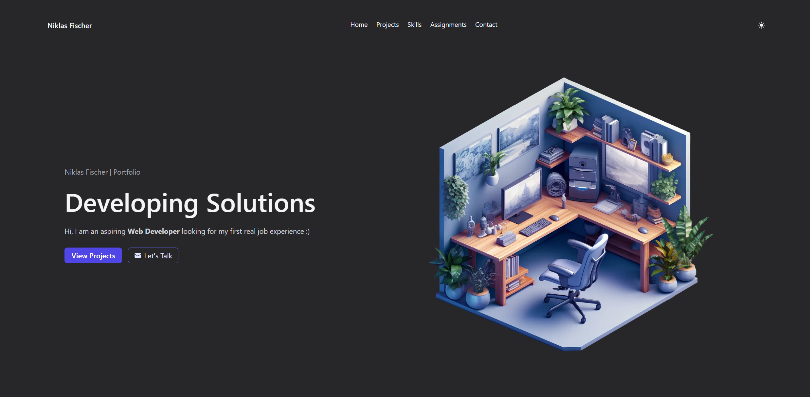
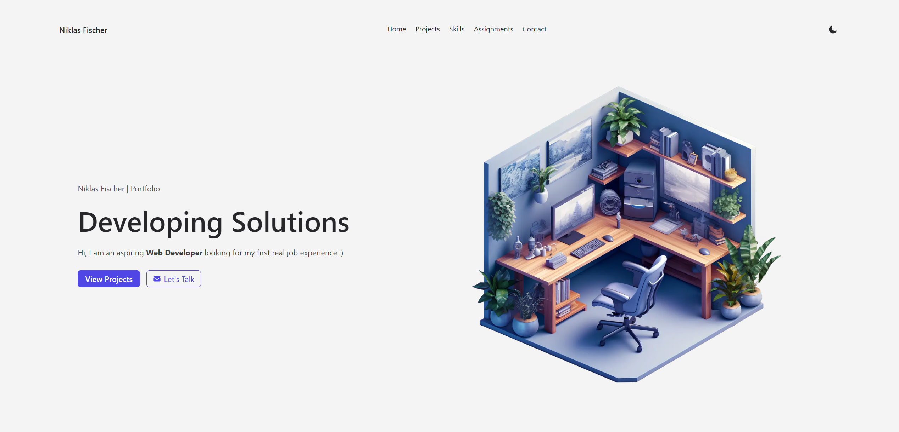

# Welcome to my portfolio

<a href="https://www.niklasfischer.dev" rel='noreferrer' >
  <!-- <p align="center" id="hero-image">
    
  </p> -->
  <p align="center" id="hero-image">

  <picture>
    <source media="(prefers-color-scheme: dark)" srcset="./.github/assets/hero-section-dark.png">
    <source media="(prefers-color-scheme: light)" srcset="./.github/assets/hero-section.png">
    
  </picture>
  </p>
</a>

## Demo

**Visit portfolio: [https://niklasfischer.dev](https://www.niklasfischer.dev)**

## About

This projects utilizes Next.js, TypeScript, Cypress and Tailwind.

## Scripts

First, run the development server:

```bash
yarn dev
```

Open [http://localhost:3000](http://localhost:3000) with your browser to see the result.
